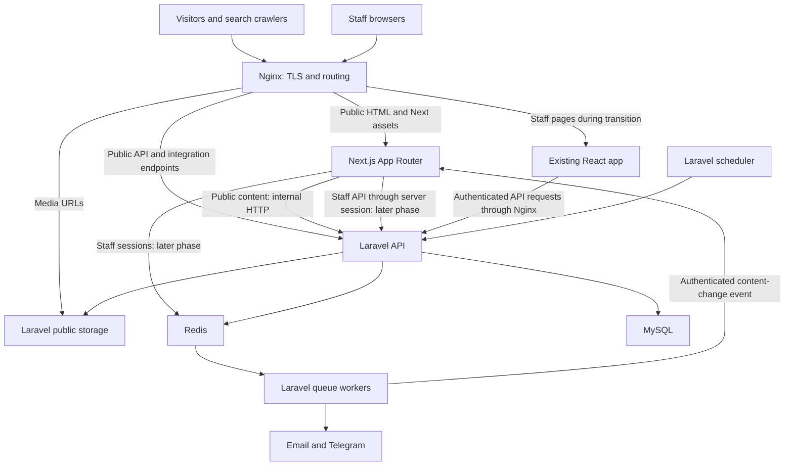

# tour-armenia.com: Next.js architecture and migration plan

Status: proposed design, prepared 15 September 2026. This document does not implement the migration.

## 1. Decision and success criteria

Move the frontend to the Next.js App Router while Laravel remains the application backend. Deliver public pages first, migrate the booking experience next, then move staff screens. Reuse the existing React design, TypeScript domain models, translations, and tested business-facing UI where appropriate.

The first release succeeds when published tour content, internal links, and page metadata are present in the server HTML; existing journeys still work; and Google can retrieve the public pages and sitemap. Search positions and bookings are measured after launch. Framework adoption alone is not a ranking outcome.

Working assumptions:

- The canonical origin is `https://tour-armenia.com`.
- English keeps the existing unprefixed URLs. Russian and Armenian get `/ru` and `/hy` prefixes.
- Deployment follows the existing Ubuntu/Docker/Nginx topology. Production API and media origins must be verified before implementation; the repository allows a separate API hostname.
- The current backend, database, media storage, queue workers, and scheduler continue to own their existing responsibilities.
- Pin a supported stable Next.js release and its compatible React/Node versions when implementation starts. Use documented App Router features and explicit caching policies.

Google can render JavaScript, and recommends considering server rendering or prerendering to improve content delivery to crawlers and visitors. [Google JavaScript SEO guidance](https://developers.google.com/search/docs/crawling-indexing/javascript/javascript-seo-basics)

## 2. Current system and migration constraints

The frontend is Vite + React + React Router + TanStack Query + i18next. Its initial HTML contains an empty React root. Most content is fetched in the browser. `RouteMeta` changes the document title, while the HTML description remains generic.

The backend already supplies translated tour, destination, and category SEO fields. Public catalog endpoints are outside the authenticated route groups in [api.php](../../armenia-tourism-be/routes/api.php). Existing `/api/v1` contracts are the integration baseline.

| Existing behavior | Architectural consequence |
| --- | --- |
| English URLs have no language prefix | Preserve them and add translated variants |
| i18n reads `localStorage` and `navigator` at module initialization | Replace with request-specific server initialization and scoped browser providers |
| API client imports browser i18n and auth storage | Separate server and browser API clients |
| Category page ignores its slug; catalogs expose only the first page | Correct filtering and implement crawlable pagination |
| API may return a fallback translation | Make translation publication and exact-locale retrieval explicit |
| Confirmation uses React Router `location.state` | Navigate successful bookings to a durable booking URL |
| A new idempotency UUID is generated on every submission | Persist one key for retries of the same booking attempt |
| Laravel creates `/booking/{bookingNumber}/{token}` and `/admin/bookings/{id}` links | Preserve both route families throughout rollout |
| Sanctum bearer tokens are currently in browser storage | Retain that behavior in the legacy app; introduce server-held sessions when staff screens migrate |
| Frontend is currently served as static files | Add a running Next.js Node service behind Nginx |

Sources in this workspace: [router](../src/app/router.tsx), [API client](../src/lib/api-client.ts), [i18n initialization](../src/i18n/index.ts), [booking page](../src/pages/booking/BookingPage.tsx), [confirmation page](../src/pages/booking/BookingConfirmationPage.tsx), and [deployment guide](../../armenia-tourism-be/docs/DEPLOYMENT.md).

## 3. System architecture



### Ownership

| Layer | Owns |
| --- | --- |
| Next.js | Page routes, HTML rendering, public language URLs, metadata, sitemap, image presentation, frontend interaction |
| Laravel | Catalog publication, prices, availability, bookings, authentication, authorization, validation, uploads, notifications and integration endpoints |
| MySQL | Business records and transactions |
| Redis | Existing backend queues/cache; a separate namespace for future web sessions |
| Nginx | HTTPS entry point, upstream routing, asset delivery, request limits and trusted forwarding |

Next.js retrieves business data through Laravel. Pricing and permission decisions stay in their existing Laravel services and policies.

## 4. Routes and languages

### Public URL policy

| English | Russian | Armenian |
| --- | --- | --- |
| `/` | `/ru` | `/hy` |
| `/tours` | `/ru/tours` | `/hy/tours` |
| `/tours/{slug}` | `/ru/tours/{slug}` | `/hy/tours/{slug}` |
| `/tours/category/{slug}` | `/ru/tours/category/{slug}` | `/hy/tours/category/{slug}` |
| `/destinations` | `/ru/destinations` | `/hy/destinations` |
| `/destinations/{slug}` | `/ru/destinations/{slug}` | `/hy/destinations/{slug}` |
| `/cars`, `/about`, `/contact`, `/faq` | Matching `/ru/...` routes | Matching `/hy/...` routes |
| `/build-your-trip` | `/ru/build-your-trip` | `/hy/build-your-trip` |

Keep current entity slugs. The requested URL determines public content language, including metadata. A language selector links to a published equivalent of the current page. Browser language can inform a suggestion, but must not silently change the content of an English URL.

Implementation: one internal `[locale]` public route tree. `proxy.ts` rewrites unprefixed public URLs to the internal English tree. Direct `/en/...` public requests permanently redirect to the public unprefixed equivalent. Validate the `en|ru|hy` allowlist before rendering. This routing layer does not fetch catalog data or authenticate users. Exclude `/api/*`, `/bff/*`, `/internal/*`, `/healthz`, `/_next/*`, crawler files and static assets from locale handling. Booking, admin and driver pages receive a document language but are excluded from locale rewriting. `/ru/admin`, `/hy/driver`, `/ru/booking` and other localized private-route variants return 404. Build links and canonicals through one helper that understands the public URL policy, never from the internal rewritten path.

Use a consistent no-trailing-slash policy except `/`. Redirect aliases once, preserving functional query parameters. Keep unknown URLs as missing pages rather than redirecting them to the homepage. Preserve existing slugs during the migration. To retain the ability to rename a published entity afterward, add persistent old-slug aliases pointing to its current entity ID, reject collisions/cycles, and resolve old URLs through a one-hop permanent redirect. Cache invalidation alone cannot preserve an old link.

### Catalog behavior

- `/tours` retains the existing group-tour default; normalize `format=group` away.
- `/tours?format=private` remains a distinct indexable listing with its own title and canonical.
- `format=all` and `format=premium` remain functional. Initially use `noindex,follow`; premium currently combines private tours with premium vehicle choices, and needs a distinct content strategy before indexing.
- `/tours/category/{slug}` retrieves that category and its tours. Its corrected default is all active tours in the category. Document this behavior change in migration tests.
- Use `?page=2` and actual HTML links for pagination. Keep page numbers in canonicals for indexable pages; normalize `page=1` away. Build frontend links from pagination metadata instead of exposing backend pagination URLs.
- Search, sort, passenger filters, and other unapproved filter combinations are usable but `noindex,follow` and absent from sitemaps. Their self-canonical URLs strip tracking parameters while preserving meaningful selection state.
- Invalid entities and nonexistent page numbers return 404. A valid category with no current tours gets a useful empty-state page and is excluded from indexing until useful content exists.
- Preserve `service`, `tour`, `car`, `type`, `passengers`, `vehicle`, and other existing functional parameters wherever currently supported.

### Translation publication

Laravel currently reports the requested language in `Content-Language`, even when the resource falls back to another translation. Resource `locale` identifies the actual selected translation.

Add an explicit publication contract for exact translations: `available_locales`, reliable content update time, and an opt-in `strict_locale` query flag on public catalog endpoints. Derive availability from complete, reviewed translation records; agree and encode required fields for tours, destinations, and categories during implementation. Use this condition consistently in both the manifest and queries.

`strict_locale` filters before pagination and prevents English fallback from appearing as Russian or Armenian content. It is opt-in so legacy clients retain their current behavior. When an entity exists but the requested language is not published, return a distinguishable API result and temporarily redirect the public page to its English equivalent. An unknown/inactive entity remains 404. A metadata manifest can identify the available equivalent without guessing.

Require published English content for the launch catalog. Enable Russian/Armenian pages as their content and interface translations pass review. Publish reciprocal `hreflang` links only for available equivalents, with English as `x-default`; each translated page has its own canonical. Listing alternates must point to valid corresponding listings, including valid pagination. [Google guidance for localized pages](https://developers.google.com/search/docs/specialty/international/localized-versions)

Booking and operations routes stay unprefixed. Pass a supported language through a cookie or non-sensitive preference parameter for their interface; they are outside the public indexing strategy.

## 5. Rendering and component boundaries

| Page or feature | Rendering/data strategy | Indexing |
| --- | --- | --- |
| Home | Server HTML with cached public content | Yes |
| Tours, categories, destinations, pagination | Server HTML using validated URL filters and cached API data | Approved views |
| Tour/destination details | Server HTML containing full editorial content and resolved metadata | Published translations |
| Cars, About, FAQ | Server HTML | Yes, when substantive |
| Contact | Server contact content plus interactive form | Yes |
| Trip builder | Server explanatory content plus interactive builder | Base page only |
| Booking form, confirmation, secure status | Dynamic/private pages; fresh booking data | No |
| Admin and driver screens | Authenticated server boundary plus client components, later phase | No |

A **Server Component** fetches and renders content on the server. A **Client Component** supplies interactions such as date selection, galleries, forms, and camera use. Next.js supports composing these within a page. [Next.js rendering model](https://nextjs.org/docs/app/getting-started/server-and-client-components)

Use one shared `app/layout.tsx` document root. For page requests, `proxy.ts` overwrites a private request header such as `x-tourism-locale` from the validated public path; unprefixed private pages can use a validated interface preference, defaulting to English. The root reads this header to set `<html lang>`. Never trust an externally supplied value. Public and operations group layouts then supply their own navigation/providers without additional HTML documents. This deliberately makes page rendering request-based; the public data cache still avoids repeated backend queries.

Specific rules:

- Render headings, descriptions, itineraries, inclusions, relevant starting prices, and navigation as HTML without requiring browser API requests.
- Pass resolved data to galleries and booking widgets. Keep browser effects inside those components.
- Reuse Tailwind styles, UI primitives, icons, money formatting and domain types. Replace React Router links/navigation with Next equivalents on migrated routes.
- Initialize server translations per request/locale; avoid a globally mutable i18n instance. Scope browser translation providers to their route language.
- Public layouts do not initialize staff authentication. Attach auth/query providers only where they are needed.
- Use a fresh TanStack Query client per server request when hydration is necessary. Browser query caches belong to the current session and are cleared on logout. Essential public content must already exist before hydration.
- Keep `window`, `document`, `navigator`, storage APIs, camera scanning and QR downloads inside browser-safe code. Importing the existing API/i18n modules into a Server Component requires refactoring first.

## 6. API integration

### Server reads

A server-only API module uses `LARAVEL_INTERNAL_API_URL` and native `fetch`. It explicitly supplies locale, normalized filters, timeouts, and cache policy. It checks both HTTP status and the expected response shape. It does not attach staff credentials to public catalog requests or call the application's own BFF over HTTP.

Metadata and page content share the same resolved entity loader to avoid inconsistent titles and body content. Required catalog data failures cannot silently become an empty successful page.

### Browser requests

Public interactive components use same-origin `/api/v1` through Nginx. This supports guest booking and estimates without adding a duplicate public API. The legacy app can continue using its configured endpoint during transition. Laravel sees the original request method/body and provides the authoritative response.

| Feature | Existing Laravel endpoint(s), after `/api/v1` |
| --- | --- |
| Catalog | `/tours`, `/tours/{slug}`, `/destinations`, `/destinations/{slug}` |
| Categories | `/tour-categories`, `/tour-categories/{slug}`, `/tour-categories/{slug}/tours` |
| Fleet and content | `/cars`, `/cars/{id}`, `/settings`, `/faqs`, `/reviews` |
| Tour quote | `POST /pricing/tours/estimate` |
| Other quotes | `POST /transfers/estimate`, `/private-driver/estimate`, `/custom-trips/estimate` |
| Booking | `POST /bookings`; `GET /bookings/{bookingNumber}/{token}` |
| Inquiries/reviews | `POST /contact-inquiries`, `POST /reviews` |
| Staff auth | `/auth/login`, `/auth/me`, `/auth/logout` |
| Operations | `/admin/*`, `/driver/*`, `/check-ins/*`, `/telegram/*` |
| Telegram webhook | `POST /telegram/webhook` |

Preserve validation errors (422), authentication/permission failures (401/403), idempotency/availability conflicts, and rate-limit responses (429, including retry information). Retry safe reads selectively; do not automatically replay mutations without their established idempotency behavior.

### Planned additive Laravel work

1. Expose exact translation availability and truthful public-content modification timestamps.
2. Support opt-in strict-locale catalog/detail queries, filtering before pagination.
3. Add `GET /api/v1/seo/pages`: a paginated publication manifest containing public entity type, slug, available locales, per-locale indexing eligibility and content update timestamps. Eligibility includes the empty-category policy, not just the record's active flag. It contains no customer or staff data. Next owns frontend URL construction and sitemap XML.
4. Emit content-change events after committed tour, destination, category, translation, price, media and public-setting edits. Next receives authenticated invalidation requests with retries.
5. In the staff migration phase, align web-issued token expiry with the new session lifetime. Preserve API authorization semantics.
6. Add persistent published-slug aliases and a small `GET /api/v1/seo/resolve?type=...&slug=...` contract. On a missing current slug, Next can distinguish a valid old alias from a truly missing entity and permanently redirect to the current public URL. Never redirect an old slug to an inactive entity or unrelated homepage. Keep published slug renaming unavailable until this contract and its tests exist.

No business data migration to a Next.js database is part of this plan.

## 7. Caching and content freshness

Start with a single Next.js instance, per-request server rendering, explicit public-data caching and the standard App Router model. Full-page static generation/ISR is a later optimization; the shared document root reads the request language, so the initial design does not claim to statically cache whole pages. Do not mix an additional cache model into the initial migration. Public cache keys include resource identity, locale and normalized filters; personalized requests always use `no-store`. Next documents configurable revalidation on server fetches. [Fetch caching reference](https://nextjs.org/docs/app/api-reference/functions/fetch)

| Data | Initial refresh policy | Invalidation examples |
| --- | --- | --- |
| Tour details and catalog lists | 5-minute revalidation | Tour, translation, price, category or image edit |
| Destination details/lists | 15-minute revalidation | Destination, translation or image edit |
| Public settings and FAQs | 15-minute revalidation | CMS publication/edit |
| Sitemap manifest | 5-minute revalidation | Publication, unpublication or slug change |
| Estimates, availability, bookings, staff data | Never shared-cache | Read fresh |

These intervals are refresh targets. Revalidation may serve an older successful result during refresh or API failures; a timer alone is not a maximum staleness guarantee. Laravel validates current price and availability when quoting and booking.

### Content update flow

1. An administrator updates a record in Laravel.
2. The transaction commits.
3. Laravel dispatches an event to `POST /internal/revalidate` on Next.js. Authenticate the event, enforce a short replay window, validate resource identifiers, and deduplicate event IDs.
4. Next invalidates affected tags for all relevant locales and dependent pages: details, listings, old/new categories, featured homepage content and sitemap.
5. The next request regenerates the content. A queue job retries failed deliveries and monitoring reports failures.

Use descriptive tags such as `tour:42`, `tours:ru`, `destinations:en`, `public-settings`, and `seo-manifest`. Events contain the old and new slug/category where necessary. For unpublication, deletion, or price correction, expire the affected entries so the next request blocks on fresh data. The current API supports explicit immediate expiry for external invalidation. [Next.js revalidateTag](https://nextjs.org/docs/app/api-reference/functions/revalidateTag)

Operational target: successful invalidation within 60 seconds when dependencies are healthy; alert on repeated failures. Do not call an unpublished page gone until a subsequent request has confirmed the result. Keep a repair action to invalidate a specific resource or all public content.

Nginx initially caches fingerprinted assets only, leaving HTML/data cache behavior to Next. Adding replicas requires a compatible shared Next cache and cross-instance invalidation; Redis sessions alone do not supply that cache. Deployment replaces code caches by build version. [Next.js self-hosted caching](https://nextjs.org/docs/app/guides/self-hosting)

## 8. Metadata, crawler files and response behavior

### Metadata

Each indexable page gets a specific title, description, absolute canonical URL, correct HTML language, published language alternates, and social metadata. Prefer Laravel's existing `seo.title`/`seo.description`, then meaningful localized content fallbacks. Resolve these from the same record as the visible page. Site identity and contact details use verified business content.

Use `generateMetadata` and a single canonical URL helper based on `SITE_URL`. Prevent the internal English prefix, API hostname, preview hostname, booking tokens, and tracking parameters from entering public metadata. Verify metadata in the complete HTML response; account for Next's metadata streaming behavior when selecting the implementation. [Next.js metadata](https://nextjs.org/docs/app/getting-started/metadata-and-og-images)

Add truthful Organization/TravelAgency, WebSite and BreadcrumbList structured data where applicable. Tour-specific markup must describe visible facts and meet the chosen schema's requirements. Do not invent reviews, ratings, availability or prices; schema vocabulary does not automatically make a tour eligible for a Google rich result. [Google structured-data guidance](https://developers.google.com/search/docs/appearance/structured-data/intro-structured-data)

### Crawling

- Next owns `/robots.txt` and `/sitemap.xml`; neither goes through the legacy SPA fallback.
- Generate the sitemap from all pages of the publication manifest, plus approved static pages and curated tour listings. Never stop at the API's first result page.
- Include only canonical, published, indexable URLs and valid language equivalents. Pagination remains discoverable through HTML links.
- Use actual content update times for `lastmod`, including translations and public prices/media where relevant. Omit it when unknown instead of using deployment time.
- Keep XML below sitemap protocol limits; introduce a sitemap index and split files if the catalog grows beyond them. Return valid content types and preserve a previous valid sitemap during brief data outages; never publish a successful empty sitemap because the API failed.
- Exclude booking, admin, driver, API, BFF, preview and unapproved filtered pages from sitemaps. Page-level `noindex` must be retrievable by a crawler; robots blocking is not a substitute for removal from indexing.
- Production previews require access protection and `noindex`; the production release must remove preview indexing restrictions.

Next supports generated sitemap files and localized alternatives. [Sitemap reference](https://nextjs.org/docs/app/api-reference/file-conventions/metadata/sitemap)

### Missing pages and upstream failures

Resolve invalid/inactive tour or destination records before flushing a public detail response. Return a real 404 with an appropriate page. In Next.js, streamed not-found responses can retain HTTP 200, so this requires deliberate loading/Suspense placement and a production HTTP test. Do not assume that calling `notFound()` always changes an already-streamed status. [Next.js not-found behavior](https://nextjs.org/docs/app/api-reference/file-conventions/not-found)

Treat API outages as temporary failures, not missing entities. Preserve valid cached public pages when appropriate. Uncached failures must go through a pre-render error path that returns a server error; status handling is an implementation acceptance gate. A retry component alone does not prove the HTTP behavior is correct.

## 9. Booking, estimates and existing links

The guest booking flow stays under unprefixed `/booking` routes, including all current service modes. The existing `ServiceEstimatorPage` file is not wired into the router; do not accidentally introduce new service landing pages as part of route parity.

1. A visitor chooses a tour or builds a trip.
2. React collects date, passengers, car preferences and other inputs.
3. The browser requests a fresh Laravel estimate through `/api/v1`.
4. Laravel calculates the quote and validates applicable availability.
5. The browser submits the booking with an idempotency key tied to the unchanged attempt. Reuse that key after timeouts/retries; create a new one for a materially different attempt. Disable duplicate UI submissions as an additional guard.
6. Laravel validates the transaction again, creates or returns the booking, and handles notifications.
7. Next navigates to `/booking/{bookingNumber}/{token}`. This URL supports refresh and existing email links. Keep `/booking/confirmation` as a compatibility entry that safely returns to the booking flow when no confirmation context exists.

Preserve `amt.booking.draft` and compatible session-storage data during transition. Read it only after browser initialization. Pass the chosen interface language separately from the stable booking path.

Keep existing booking numbers, access-token hashes, database records, Laravel `APP_KEY`, and the distinct `AMT-CHECKIN:` QR payload contract. QR display/download remain browser components; staff scanning remains role-authorized through Laravel.

Marketing content may display a cached starting price. A personalized quote and final booking always use Laravel's current calculation. Preserve premium vehicle reservation semantics and the currently disabled operational assignment setting. Migration does not enable an assignment feature merely because an endpoint exists.

The active UI submits `pay_driver`; online payment providers are not implemented. Preserve this behavior. Payment enum values alone do not establish working checkout support.

Booking pages and responses use private/no-store caching, `noindex`, and restrictive referrer handling. Redact access tokens and customer data from access logs, error reports and analytics; use route templates for measurement. Disable speculative prefetch of token-bearing links.

## 10. Authentication and staff migration

### Public launch

Admin and driver screens continue in the current app under their existing URLs, calling the current Sanctum API. Their auth state does not enter public page rendering or public caches.

### Final staff architecture

Introduce a scoped **BFF** (backend for frontend): Next route handlers that translate a browser session into the existing Laravel bearer-token requests.

1. `POST /bff/auth/login` validates the request origin and sends credentials to Laravel `/auth/login`.
2. Laravel authenticates the user and returns its token/user contract.
3. Next stores the token server-side in Redis under a random opaque session ID. The browser receives a host-only cookie such as `__Host-tourism-session`, with `HttpOnly`, `Secure`, `SameSite=Lax`, `Path=/` and no Domain attribute. Delete it with matching path/name settings.
4. Protected server pages resolve that session and confirm the current user through Laravel. Interactive staff components use allowlisted `/bff/...` handlers.
5. Laravel evaluates role and object-level authorization on every operation. Next route guards improve navigation but do not replace backend permissions.
6. Logout revokes the Laravel token and deletes the server session and cookie. Expired/revoked sessions require login again.

Use finite, configurable session lifetimes with matching expiry for web-issued Laravel tokens and cleanup of expired sessions. Rotate the session ID on login. Preserve credentials and the Laravel identity store; a second user database is unnecessary.

Allowlist upstream path patterns, methods and forwarded headers. The staff bridge covers authorized `/admin/*`, `/driver/*`, both check-in endpoints, and the exact Telegram connection read/link/preferences/delete operations. `/telegram/webhook` stays directly routed to Laravel and is excluded from the staff BFF. Protect cookie-authenticated mutations, including login/logout, with origin checks and CSRF protection. Never accept arbitrary proxy destination URLs. Staff uploads require streaming multipart support and limits compatible with Laravel (currently 10 MiB images and 100 MiB tour videos, plus multipart overhead); avoid buffering large videos or imposing Server Action limits on existing uploads.

The legacy browser token cannot automatically become a server session. Admin and driver screens both use `/admin/login`, so switch `/admin/login`, `/admin/*` and `/driver/*` together after all staff flows pass. Plan a one-time staff sign-in at this atomic switch, then clear the legacy browser token. Read user/role information from authenticated backend responses. A staff rollback similarly requires signing into the restored legacy application.

Sanctum supports bearer authentication; the BFF session bridge is our application design around that existing contract. [Laravel Sanctum](https://laravel.com/framework/docs/12.x/sanctum)

## 11. Frontend code organization

Proposed layout of the migrated frontend repository:

```text
src/
  app/
    layout.tsx                   # Single HTML document root; request language
    [locale]/
      layout.tsx
      page.tsx
      tours/
        page.tsx
        [slug]/page.tsx
        category/[slug]/page.tsx
      destinations/
        page.tsx
        [slug]/page.tsx
      cars/page.tsx
      about/page.tsx
      contact/page.tsx
      faq/page.tsx
      build-your-trip/page.tsx
      not-found.tsx
    (booking)/
      layout.tsx
      booking/page.tsx
      booking/confirmation/page.tsx
      booking/[bookingNumber]/[token]/page.tsx
    (auth)/
      admin/login/page.tsx
    (operations)/
      layout.tsx                 # Authenticated boundary, excludes login
      admin/...                  # Route-for-route migration in later phase
      driver/...
    bff/                         # Auth and allowlisted staff handlers, later phase
    internal/revalidate/route.ts
    healthz/route.ts
    robots.ts
    sitemap.ts
    not-found.tsx
  components/
    ui/
    layout/
    catalog/
    booking/
    operations/
  features/                      # Domain UI, forms, browser query/mutation hooks
  lib/
    api/server.ts                # server-only, native fetch, public/private policies
    api/browser.ts               # same-origin public API and scoped staff BFF clients
    auth/session.ts              # server-only session bridge, later phase
    seo/metadata.ts
    seo/urls.ts
    seo/structured-data.ts
    cache/tags.ts
  i18n/
    resources.ts                 # Reused interface catalogs
    server.ts                    # Per-locale server initialization
    client-provider.tsx
    routing.ts
  types/
  styles/
  proxy.ts                       # Locale rewriting, narrowly matched
public/
next.config.ts
Dockerfile
docs/NEXTJS_ARCHITECTURE.md
```

Route groups in parentheses do not change URLs. The single root document supports the root `not-found.tsx`, including wholly unmatched paths; nested layouts provide public/booking/staff navigation and scoped providers. Keep the login page outside the authenticated operations layout so unauthenticated users can reach it. Use normal anchors across Next/legacy boundaries during rollout so client routers do not intercept another application's routes. Build a legacy coexistence release that updates those links too; the original unchanged image is retained for rollback but is not sufficient for every cross-application navigation case.

## 12. Media, performance and accessibility

Laravel remains responsible for uploads and durable media URLs. Render images with appropriate sizes, width/height or aspect ratio, meaningful alt text, and lazy loading below the fold. Optimize the approximately 2 MiB homepage hero source and prioritize the actual hero image. Allowlist configured public media origins for Next's image optimizer; internal Docker addresses must never appear in browser markup.

Preserve existing `/storage/...` URLs and configure externally reachable storage URLs in Laravel. Use new/versioned media paths on replacement so image caches cannot indefinitely serve a previous image. Supply video posters and avoid making video download a prerequisite for reading tour content.

Keep keyboard navigation, form labels/error messages, readable heading order, mobile layouts and reduced-motion behavior. Track mobile Core Web Vitals and API latency before/after migration using the same measurement conditions. Avoid shipping camera/scanner and admin code in public page bundles.

## 13. Deployment and operations

Run Next.js as a production Node process in a Docker image using standalone output, behind the existing Nginx edge. Include its static assets and `public` directory in the image. Add a health endpoint and graceful shutdown. The rendering design requires a server runtime; publishing only a static `out` directory would need a different refresh/deployment design. [Next.js self-hosting](https://nextjs.org/docs/app/guides/self-hosting)

### Edge route ownership during transition

| Path | Upstream |
| --- | --- |
| `/api/v1/*` | Laravel Nginx/API, including Telegram webhook and existing auth routes |
| `/storage/*` | Existing public media storage |
| `/admin`, `/admin/*`, `/driver`, `/driver/*` | Legacy frontend until the atomic staff cutover, including shared `/admin/login` |
| `/booking`, `/booking/*`, `/build-your-trip` | Legacy frontend until the transactional rollout phase |
| `/assets/*` | Legacy fingerprinted assets while that app is in use |
| `/_next/*`, `/bff/*`, `/internal/revalidate`, `/healthz` | Next service; restrict internal endpoint access |
| `/robots.txt`, `/sitemap.xml`, migrated public paths | Next service |
| Other paths | Next route resolution/404 |

Initially expose localized trip-builder paths only when that feature moves; do not advertise routes the legacy app cannot serve. Copy or correctly route shared legacy `/images/...` assets during coexistence. Serve exact crawler files before broad fallback rules. Configure both bare route names and descendants (`/admin` as well as `/admin/`).

Keep the actual existing public API hostname working for external clients if production uses one. Same-origin `/api/v1` is an edge addition, not evidence that it currently works. Test it explicitly: the earlier live check returned app HTML on that path, which may simply indicate a separately configured API origin.

Forward host, scheme and visitor IP through explicitly trusted proxies. Otherwise existing backend rate limits can combine all visitors under an upstream address. Apply the same requirement to later BFF requests. Coordinate upload size/timeouts with backend limits. Preserve Next response headers and streaming behavior; do not apply a blanket SPA fallback or HTML cache rule to Next paths.

Start with one Next instance and persistent data-cache storage scoped to its build. Configure monitoring for rendering/API failures, invalidation delivery, worker failures, cache age, disk/memory, and session-store health. Add shared cache coordination before multiple Next instances. Keep MySQL/Redis private and preserve existing backups and queue/scheduler lifecycle.

### Configuration contract

| Variable | Owner and purpose |
| --- | --- |
| `SITE_URL=https://tour-armenia.com` | Next server; canonical origin |
| `LARAVEL_INTERNAL_API_URL` | Next server; reachable internal API base ending `/api/v1` |
| `PUBLIC_MEDIA_ORIGIN` | Next server configuration; allowlisted media origin |
| `REVALIDATION_SECRET` | Laravel and Next; authenticate publication events |
| `WEB_SESSION_REDIS_URL` | Next server, staff phase; dedicated session namespace/access |
| `WEB_SESSION_TTL_SECONDS` | Next server, staff phase; aligned token/session expiry |
| `FRONTEND_URL=https://tour-armenia.com` | Existing Laravel config; notification and booking links |
| Existing `APP_URL`, storage, queue and mail variables | Laravel; verify public URLs and existing behavior |

Browser clients use relative API paths. Secrets and internal service URLs never use a `NEXT_PUBLIC_` prefix. During the initial implementation, build public outputs against environment-specific configuration; do not promote prerendered preview HTML into production with the wrong canonical hostname. Smoke-test the final image with production routing before switching traffic.

## 14. Migration phases and deliverables

### Phase 0: baseline and contracts

- Inventory every route, supported query parameter, current published slug, old booking link and integration endpoint.
- Record current production API/media origins, deployment ownership and health checks.
- Capture Google Search Console indexing/performance baseline if account access is available, plus mobile and booking-flow baselines.
- Create an isolated migration branch/worktree in the frontend repository. Preserve the current frontend image and API contract tests.
- Agree the English/translated publication inventory and canonical policy in this document.

Deliverable: route/contract checklist and a reproducible baseline. Search Console access helps measurement but does not block local implementation.

### Phase 1: Next foundation

- Establish the App Router, styles, document layouts, language helpers and separate API clients.
- Add Docker/CI, environment validation, health endpoint and private staging deployment.
- Migrate a representative tour detail page as a vertical slice, including data, metadata, errors, media and an interactive booking entry point.
- Prove that the production build returns meaningful HTML and real missing-page behavior.

Deliverable: validated page template and deployment path.

### Phase 2: public catalog and SEO

- Migrate home, tours, categories, destinations, fleet, About, Contact and FAQ.
- Implement category filtering, pagination, approved query policies and exact-locale behavior.
- Add the Laravel publication contract, sitemap manifest and invalidation events.
- Add slug alias resolution before supporting changes to published slugs.
- Complete metadata, canonical/language links, crawler files and appropriate structured data.
- Route public pages to Next on staging while transactional/staff routes continue using the legacy application.

Deliverable: complete public website ready for traffic switch, including working links into legacy bookings. An optional public-only production switch can happen here after applying the Phase 4 launch gates; transactional and staff paths remain on the coexistence build.

### Phase 3: transactional pages

- Port trip builder, booking form, live estimates, guest booking status and QR display.
- Preserve premium car and service parameters, draft compatibility and notification URLs.
- Fix retry idempotency and replace confirmation history-state dependence.
- Apply private cache/indexing/logging rules and validate all currently supported service flows.

Deliverable: booking journey served by Next with Laravel behavior preserved. If public pages already launched after Phase 2, switch the transactional route family separately using the same Phase 4 gates.

### Phase 4: launch gates and measurement for each traffic switch

- Deploy backward-compatible API additions first, then the tested Next build.
- Switch only the validated path families at Nginx; use identical responses for users and crawlers.
- Verify live HTML, status codes, assets, API/media routing, redirects, sitemap and existing booking links.
- Submit the production sitemap in Search Console and inspect representative public URLs when account access is available.
- Monitor errors, indexing, visitor inquiries and bookings. Keep the old frontend image available for rollback.

Deliverable: public Next site in production with recorded verification results.

### Phase 5: operations and completion

- Build the server-session BFF and port admin/manager/driver pages route for route.
- Cover catalog editing, media, calendar, customer/booking tools, check-in, Telegram connection and all CMS sections.
- Validate all role permissions and one-time staff login, then atomically switch shared `/admin/login` and both `/admin/*` and `/driver/*` route families.
- Retain old asset availability for existing sessions during an agreed overlap, then retire the Vite runtime.

Deliverable: complete frontend migration; one Next frontend and one Laravel backend.

The public SEO launch is independent of the later staff migration. Estimates of effort follow the Phase 1 slice rather than assuming all React components can move unchanged.

## 15. Testing and release gates

Use existing domain/UI tests where they still verify behavior. Add focused integration and browser coverage for migration boundaries rather than rewriting every component test.

### Public rendering and SEO

- Production HTTP responses contain the correct title, description, canonical, language, headings, itinerary text and internal links for published pages.
- Public content remains readable with JavaScript disabled; interactive booking behavior is tested with JavaScript enabled.
- Category membership, private/group behavior and page-two discovery are correct. Every published tour is reachable through links or the sitemap.
- English/Russian/Armenian caches and metadata never mix. Fallback translations are not advertised as published equivalents.
- Unknown/inactive entities, invalid locales and nonexistent page numbers have the agreed status/redirect behavior. Test streaming and upstream failure cases.
- Sitemap XML is valid, complete, escaped and consistent with canonicals/alternates. Crawler files have correct content types.
- Edits, price changes, slug/category changes and unpublication invalidate all affected views. Failed invalidation has a tested retry/alert path.

### Customer and staff behavior

- A tour booking and custom trip complete from listing to a refreshable confirmation/status page.
- Existing transfer/private-driver modes, premium vehicle selection, discounts, dates and money units remain consistent with Laravel responses.
- Repeating a timed-out booking with the same unchanged attempt creates exactly one booking; changed payloads do not silently reuse it.
- Previously issued email links and QR tickets work. Staff camera scanning, download, partial check-in and role restrictions remain correct.
- Private pages/API/BFF responses never enter shared caches or sitemaps; credentials/tokens do not appear in public HTML, caches or telemetry.
- All staff route families retain their allowed roles. Cross-user/role data does not survive session changes.
- Media upload/display, email notifications and Telegram webhook/queue processing survive deployment.

### Release and observation

- Run typecheck, lint, existing relevant tests, production build and browser journeys in CI/staging. Test caching on the production server, not only the dev server.
- Verify reverse-proxy routing, request forwarding, redirects, deep links, asset versions and environment values from outside the deployment network.
- Confirm rollback can route traffic to the previous frontend image without reverting business records.
- Monitor per-route HTTP failures, slow API requests, cache invalidation, sitemap freshness and booking completion alongside Search Console impressions/clicks/indexed pages.

## 16. Rollback and remaining verification

Deploy backend changes additively so both frontend versions can use `/api/v1`. Retain the previous Docker image and edge routing configuration. Prefer rolling back to the previous healthy Next build, which understands newly published localized URLs. Keep booking data, uploaded files, keys, workers and notification jobs intact. Preserve old assets through the rollout overlap.

If restoring the original Vite application is necessary, activate a prepared compatibility edge configuration: temporarily redirect published `/ru/...` and `/hy/...` public pages to their valid unprefixed equivalents, preserving functional query parameters; serve an English-only valid sitemap and valid robots file from a saved fallback artifact; retain published slug redirects; and restore the legacy API/asset mappings. This is a reduced-language emergency mode, not a normal release. Test it before launch. Do not send new language routes or crawler files into the old SPA fallback. Later staff rollback switches both staff areas and their shared login together and requires legacy sign-in again.

English URLs and booking routes remain stable. Any necessary URL changes need a one-to-one permanent redirect and updated internal links; test both user navigation and crawler responses. [Google site-move guidance](https://developers.google.com/search/docs/crawling-indexing/site-move-with-url-changes)

The following facts need verification during implementation, not speculative assumptions in code:

- Actual production API and media origins and access to deploy/reload edge routing.
- Published content and translation completeness; approved brand/contact information.
- Production resource capacity for a Node process and image optimization.
- Baseline Search Console results and property ownership when available.
- Existing external links, active staff sessions, and expected overlap/rollback window.

This architecture is ready to guide the migration. Implementation begins with the Phase 0 inventory and Phase 1 tour-page slice.
